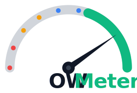

<p align="center">
  
</p>

<p align="center">
  <a href="https://owmeter.dev"><strong>owmeter.dev</strong></a>
</p>

[](https://owmeter.dev)

Owmeter is an open-source web application that lets site owners scan their websites against the [OWASP Top 10](https://owasp.org/www-project-top-ten/) and receive a security score. Before any scan runs, the user must prove they own the domain — so results can never be abused to probe third-party sites.

---

## Features

- **Domain ownership verification** before scanning (DNS TXT record, HTML meta tag, or `.well-known` file)
- **Passive scan** — checks HTTP headers, TLS configuration, cookie flags, and common misconfigurations without sending traffic through ZAP
- **Active scan** — full OWASP ZAP spider + active attack mode for deeper findings
- **OWASP Top 10 coverage** — findings mapped to all ten categories (A01–A10)
- **Per-category score breakdown** — see exactly where points are lost
- **PDF certificate** — download a shareable security report after each scan
- **Async job queue** — long-running ZAP scans are processed in the background via BullMQ + Redis
- **i18n** — English and Spanish UI out of the box
- **OAuth login** — Google and GitHub providers via Auth.js v5

## Stack

| Layer | Technology |
|---|---|
| Framework | Next.js 16 (App Router) + TypeScript |
| Auth | Auth.js v5 (next-auth@beta) — JWT sessions |
| Database | PostgreSQL 17 via Prisma 7 + `@prisma/adapter-pg` |
| Queue | BullMQ + Redis 7 |
| Active scanner | OWASP ZAP (Docker, REST API) |
| i18n | next-intl — path-based (`/en/`, `/es/`) |
| Styling | Tailwind CSS v4 |
| PDF | @react-pdf/renderer |
| Logging | pino |
| Validation | Zod v4 |
| Testing | Vitest + React Testing Library + happy-dom |

## How scoring works

Each OWASP category carries a maximum point value. A passive scan evaluates the categories that are observable without code access (headers, TLS, cookies, path probes). An active ZAP scan covers additional categories. Findings deduct points based on severity:

| Severity | Points lost |
|---|---|
| Info | 0 |
| Low | 2 |
| Medium | 5 |
| High | 10 |
| Critical | 20 |

The final score is capped at 100. Categories not evaluated in a given scan mode count as full marks.

---

## Prerequisites

- Node.js 20+
- Docker and Docker Compose
- A Google OAuth app and/or a GitHub OAuth app

## Getting started

### 1. Clone and install

```bash
git clone https://github.com/tasiodev/owmeter.git
cd owmeter
npm install
```

### 2. Configure environment variables

```bash
cp .env.example .env
```

Open `.env` and fill in the values:

| Variable | Description |
|---|---|
| `DATABASE_URL` | PostgreSQL connection string — matches the Docker Compose defaults |
| `AUTH_SECRET` | Random secret. Generate with `openssl rand -base64 32` |
| `AUTH_GOOGLE_ID` | Google OAuth client ID |
| `AUTH_GOOGLE_SECRET` | Google OAuth client secret |
| `AUTH_GITHUB_ID` | GitHub OAuth App client ID |
| `AUTH_GITHUB_SECRET` | GitHub OAuth App client secret |
| `REDIS_URL` | Redis connection string — `redis://localhost:6380` by default |
| `ZAP_API_KEY` | API key for the ZAP container — set a strong value in production |
| `ZAP_URL` | ZAP daemon URL — `http://localhost:8050` by default |
| `NEXT_PUBLIC_APP_URL` | Public base URL of the app (used in verification tokens and OAuth callbacks) |
| `GITHUB_TOKEN` | *(Optional)* GitHub Personal Access Token for the Advisory API. Without it the API still works but is rate-limited to 60 requests/hour — enough for occasional use but easily exhausted during development. With a token the limit rises to 5 000 req/hour. No scopes are needed; create one at [github.com/settings/tokens](https://github.com/settings/tokens). |

**Creating OAuth apps**

- Google: [console.cloud.google.com](https://console.cloud.google.com/) → APIs & Services → Credentials → OAuth 2.0 Client ID. Add `http://localhost:3000/api/auth/callback/google` as an authorized redirect URI.
- GitHub: Settings → Developer settings → OAuth Apps → New OAuth App. Set the callback URL to `http://localhost:3000/api/auth/callback/github`.

### 3. Start services

```bash
docker compose up zap redis db -d
```

This starts PostgreSQL (port 5433), Redis (port 6380), and OWASP ZAP (port 8050). ZAP takes ~30 seconds to initialize — wait until `docker compose ps` shows all containers as healthy before continuing.

### 4. Run database migrations

```bash
npx prisma migrate dev
npx prisma generate
```

### 5. Start the dev server

```bash
npm run dev
```

Open [http://localhost:3000](http://localhost:3000).

---

## Project structure

```
src/
  domain/           # Pure TypeScript — entities, value objects, domain services
  application/      # Use cases — depends on domain interfaces only, no Prisma
  infrastructure/   # Prisma repositories, ZAP client, BullMQ workers
  presentation/     # Next.js App Router pages, components, server actions
messages/           # i18n translation files (en.json, es.json)
prisma/             # Prisma schema and migrations
```

The architecture follows strict layer boundaries: infrastructure and presentation layers depend on domain interfaces — never the other way around.

## Useful commands

```bash
# Dev server
npm run dev

# Tests
npm test                  # run all tests once
npm run test:watch        # watch mode
npm run test:coverage     # coverage report

# Linting
npm run lint
npm run lint:fix

# Database
npx prisma migrate dev --name <migration-name>
npx prisma generate       # regenerate client after schema changes
npx prisma studio         # open Prisma Studio GUI

# Production build
npm run build
npm start
```

## Deployment

The app is a standard Next.js application. It requires:

1. A running PostgreSQL instance
2. A running Redis instance
3. A running OWASP ZAP daemon (`ghcr.io/zaproxy/zaproxy:stable`)
4. All environment variables from `.env.example` set in the production environment

Set `NEXT_PUBLIC_APP_URL` and the OAuth callback URLs to your production domain before deploying.

## Roadmap

- **Private GitHub repository support** — integrate as a GitHub App to allow scanning private repos without requiring a manual ZIP upload
- **Multi-language source code analysis** — extend SAST and dependency vulnerability checks to .NET (`.csproj`, NuGet), Java (`pom.xml`, Gradle), Python (`requirements.txt`, `pyproject.toml`), and Go (`go.mod`)

## Contributing

Contributions are welcome. Please open an issue first to discuss significant changes.

1. Fork the repository
2. Create a feature branch (`git checkout -b feat/your-feature`)
3. Commit your changes following the existing conventions
4. Add or update tests for any new behavior
5. Open a pull request

When adding new features, make sure the OWASP compliance checklist in [AGENTS.md](AGENTS.md) is not broken.

## License

MIT
